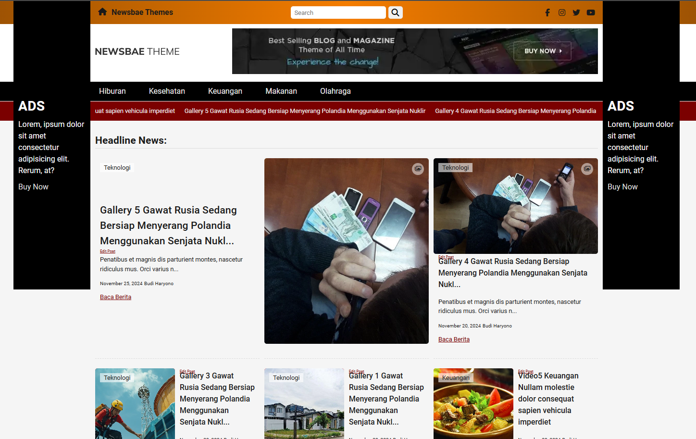
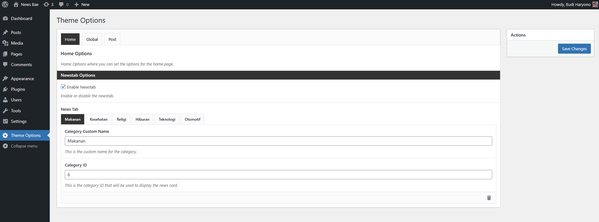

# NewsBae Theme

NewsBae is a free WordPress theme for news and magazine websites. It is fully responsive and includes multiple widget areas, custom widgets, and a theme options panel for easy customization.

With NewsBae, you can create a professional news website without any coding knowledge. The theme is optimized for speed and SEO to help your website rank higher in search engines.

You can create specific post e.g post contains video, gallery, recipe, code and more that you can choose from the post meta.

## Table of Contents

- [Demo](#demo)
- [Features](#features)
- [Installation](#installation)
- [Customization](#customization)
- [Support](#support)

## Demo

You can view a live demo of the theme [here](https://newsbae.budiharyono.id/).

## Features

- **Responsive Design**: The theme is fully responsive and looks great on all devices.
- **Widget Ready**: Multiple widget areas to add custom content and functionality.
- **Custom Widgets**: Includes custom widgets for recent posts, popular posts, and more.
- **Theme Options Panel**: Easy-to-use theme options panel to customize various aspects of the theme.
- **Regular Updates**: Regular updates to ensure compatibility with the latest WordPress version.
- **Support**: Dedicated support to help you with any issues or questions.

## Installation

1. Download the theme package.
2. Go to Appearance > Themes in your WordPress dashboard.
3. Click on "Add New" and then "Upload Theme".
4. Choose the downloaded theme package and click "Install Now".
5. Activate the theme after installation.

## Customization

Use the Theme Options Panel to customize the theme according to your needs. You can access it from Appearance > Customize in your WordPress dashboard.

## Support

For any support or questions, please contact our support team at [github.budiharyono@gmail.com](mailto:support@example.com).

